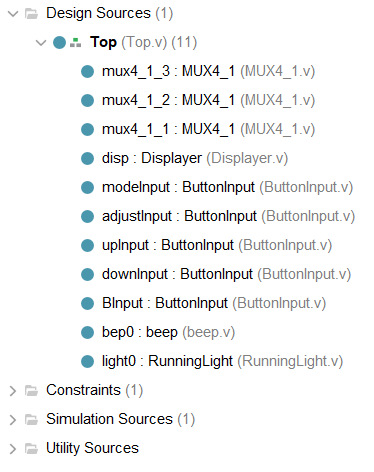
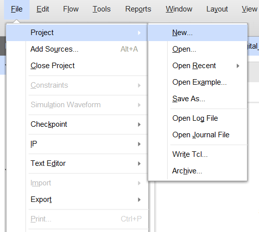
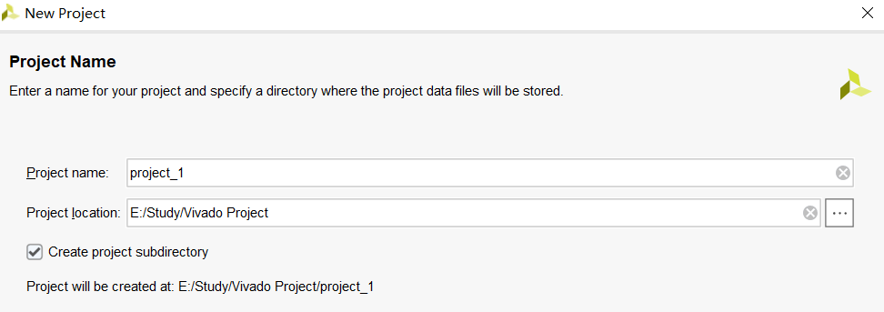
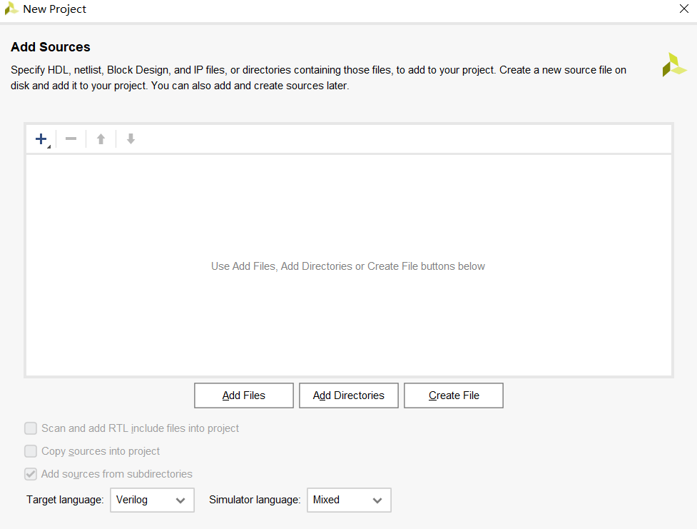
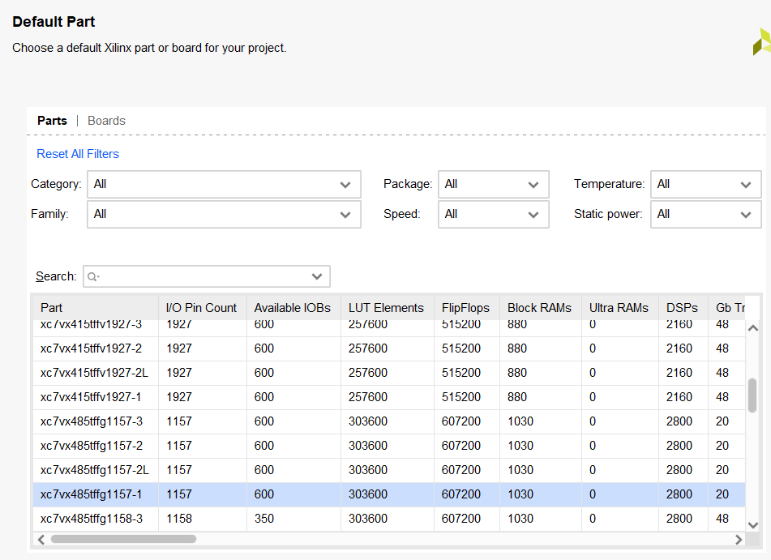

## 何为Vivado项目？

在 Vivado的使用过程中，所有的代码都是以**项目**，即**Project**的形式进行组织的。一个项目代表了一个具备完整功能的硬件设备，例如，我们在数字逻辑课上做过的流水灯、电子表等，都算是一个项目。而在龙芯杯中，我们所要编写的整个CPU也可看作是一整个项目。

每一个项目内部会包含多个`.v`格式的文件，一般来说，每个文件代表一个**模块（module）**，各个模块之间可以进行例化使用，从而将整个项目连结为一个整体。

一个 Vivado 项目的简单展示如下：



其中，Design Sources 标签下的各个文件代表了所编写的每一个模块，同时也表明了其例化情况，例如：

```
mux4_1_3 : MUX4_1
```

便代表了这是一个对 MUX4_1 模块的例化使用，而其例化后的名称为 mux4_1_3

Constraints 标签下的是管脚绑定文件，主要在下板阶段使用；Simulation Sources 标签下的是仿真文件，每次仿真中会自动生成。

## 在Vivado创建第一个项目

首先，点击 Vivado 左上角的 File 标签， 依次选择 Project-New，如下图：



对于一般使用情况来说，项目创建过程的大部分步骤可以直接点击 Next，保持默认选项及设置，下面简要介绍其中几个比较重要、可能需要进行手动修改的步骤：

- 项目名称及项目存储地址



虽然项目的名称及其存储地址并不会对项目本身的功能产生影响，但一方面，一个合理的项目名称能够帮助我们更快了解项目的具体功能，这一点在团队协作时就显得尤为重要。另一方面，**项目的存储地址务必设为纯英文路径，否则可能出现各种意想不到的错误**

- 预添加设计文件



对于并非从零开始的项目，可以在项目创建阶段将已有的设计文件直接添加进项目中。不少初学者可能会延续其他语言编程时的习惯，将待加入项目的文件直接拖入项目根目录，然而对于 Vivado 来说，这样并不能将该源文件真正加入项目，仍然需要通过 Add Dedsign Resource 的形式进行添加。由于项目创建完毕后，这一过程容易被忘记，因此，在项目创建阶段就将其加入项目不失为一个良好的选择。

- 硬件型号选择



在项目创建的最后，需要选择项目所对应的硬件型号，这是为了使得综合、实现的过程更具有针对性。在龙芯杯的比赛中，可以直接保留默认的选项，也可以选择咨询大赛官方

在完成上述一系列的设置后，点击 Finish 即可完成一个项目的创建。由此，我们便可以正式开始代码的编写了。
