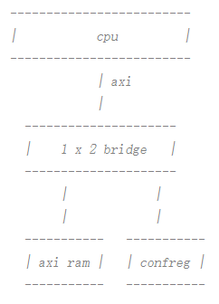
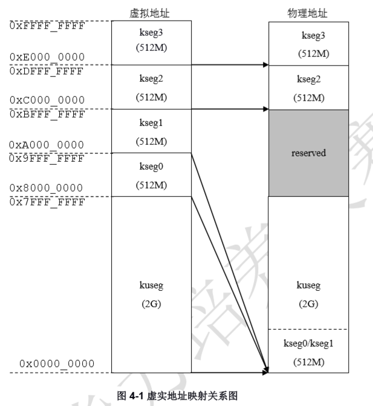

## 代码中可能出现的问题及一般Debug方法

**注：这部分内容源自本团队的实际参赛经历及体验，只针对龙芯杯这一比赛而言，并非针对所有 Verilog 项目，不具有普适性，仅供大家参考**

### 常见问题

- 虚拟地址、物理地址之间的映射

龙芯官方所给出的SOC中，将外设与RAM统一编址，对CPU仅提供一条AXI通道，以满足其对RAM或外设的访问，其结构如下：



其中的`1×2bridge`会根据CPU给出的地址的值，与外设或RAM进行交互。具体来说，对于`1faf0000`到`1fc00000`之间的地址，会被分配到外设接口进行访问，否则分配至RAM。

问题在于，CPU给出的是虚拟地址，而与外设或RAM交互时则需要使用物理地址，二者间的映射关系如下：



因此，需要在AXI模块中手动添加部分代码以实现从虚拟地址到物理地址的映射。

- IP核的使用

Vivado中自带了不少好用的IP核，合理使用可以免去不少自行设计的麻烦。例如，使用ip核crossbar可以免去资助解决读写外设、内存时的抢占与阻塞问题；使用乘法器ip核则能够一定程度提升乘法运算的效率等。

使用ip核的优点在于简单快捷，且基本能够保证正确性。但另一方面，ip核的内部实现不一定是最优的，例如乘法器、除法器等，可能存在更优的编写方法。简而言之，ip核的使用需要具体情况具体分析。

- 顶层设计的缺失

我们所实现的CPU，基本是按照《自己动手写CPU》这本书所附带的代码来实现的。这样做的好处在于能够快速上手，且能够比较清晰地理解代码。但由于在代码编写的初期，大家对于CPU本身的理解还比较浅薄，因此，对于书中代码设计不合理之处也大多继承了下来，这也导致后期的修改十分费力。

因此，为了项目后期考虑，我建议各位同学在动手编写代码之前，先进行一个简单的顶层设计，对于代码的整体结构有一个较为全面的认识后，再开始正式动手。

当然，这其中的一些问题，不经过实际的代码编写，可能确实难以体会，因此，我个人认为，模仿书本写代码仍然非常关键的一步，但务必不要将该结果当作最终的成果，而应当进行至少一次的重构。

下面简要列举几个《自己动手写CPU》一书中存在的问题：
① stall信号功能单一。作者设计stall指令的目的是实现流水线的暂停，但这一过程多少有些“简单粗暴”。一方面，不同的指令对于流水线暂停的要求略有不同，另一方面，握手信号的缺失导致流水线可能在不该暂停之时仍处于暂停状态，从而造成错误。

② 异常信号的标记混乱。虽然对于绝大多数的常量，作者均设置了对应的宏变量，使读者能够通过阅读其名称的方式了解其功能。然而，对于种类繁多的异常信号，作者的处理却多少有些草率——通过一个数组中的不同位的真假来代表不同的异常，导致代码可读性很低。

### 一般的debug方法

- 阅读错误提示

Vivado 中每次仿真产生的文字信息数量较多，但实际上关键信息并不多，且标志相当明显。

如果仿真过程中出错，则出错阶段所对应的文件夹中的`xvlog`文件中就会显示对应的错误原因，以`ERROR`作为提示词，根据错误原因进行修改，可以排除绝大多数的问题。

实际上，当仿真过程出错时，在Vivado本身的控制台中会提示用户去查看`xvlog`文件。因此，在进行任何其他的debug行为之前，查看错误提示是必不可少的。**养成这一看似不起眼的习惯，绝对能够为你节省大量的时间**

- 阅读波形图

对于那些不能通过错误提示发现的问题，则需要我们从仿真波形图入手解决了。阅读波形图基本的思考顺序如下：

① 当前错误的直接原因是什么？如某个信号的值与预期不同，或某个寄存器没有被赋予期望值等等

② 结合代码，依次前推。假设信号x、y、z之间存在如下关系：
```
x->y->z
```
现在，我们发现z的值与期待不同，那么此时就应该回头查看y的值，若y的值预期不同，则重复上述操作，直到发现与预期值相同之处。例如，此时我们发现，x的值是正确的，而y的值却不正确，那么，据此我们便可以将问题锁定在`x->y`这一步。再结合具体代码进行分析，并进行修改即可。